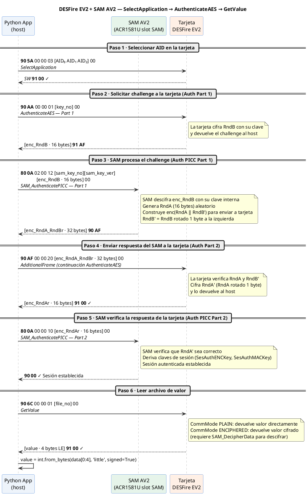

# SAM AV2 — Referencia de comandos APDU para Python

Traducción directa de los métodos C del NXP Reader Library Framework
(`jni/nxp/comps/phhalHw/src/SamAV2/`) a Python puro con `pyscard`.

Cada sección muestra el fragmento C original → el equivalente Python → cómo enviarlo.

---

## Índice

1. [Setup del reader en Mac](#1-setup-del-reader-en-mac)
2. [Constantes del protocolo](#2-constantes-del-protocolo)
3. [GetVersion](#3-getversion)
4. [KillAuthentication](#4-killauthentication)
5. [GetKeyEntry](#5-getkeyentry)
6. [Parsear respuesta de GetKeyEntry](#6-parsear-respuesta-de-getkeyentry)
7. [ChangeKeyEntry](#7-changekeyentry)
8. [GetKUCEntry](#8-getkucentry)
9. [ChangeKUCEntry](#9-changekucentry)
10. [AuthenticateHost AV2 (canal seguro host↔SAM)](#10-authenticatehost-av2)
11. [Tabla de errores](#11-tabla-de-errores)
12. [Comandos peligrosos — no tocar sin entenderlos](#12-comandos-peligrosos)
13. [Diagrama de secuencia — Leer archivo de valor con SAM](#13-diagrama-de-secuencia--leer-archivo-de-valor-con-sam)
14. [Código Python — flujo completo SelectApplication → Auth → GetValue](#14-código-python--flujo-completo-selectapplication--auth--getvalue)

---

## 1. Setup del reader en Mac

```python
# pip install pyscard
from smartcard.System import readers
from smartcard.util import toHexString, toBytes

def conectar_sam():
    """
    El ACR1581U expone el slot SAM como reader independiente.
    Nombre típico en macOS: 'ACS ACR1581 1S CL Reader SAM Slot 0'
    """
    todos = readers()
    sam_reader = next((r for r in todos if 'SAM' in str(r)), None)
    if not sam_reader:
        raise RuntimeError(f"SAM no encontrado. Readers: {todos}")
    conn = sam_reader.createConnection()
    conn.connect()
    return conn

def enviar(conn, apdu: list[int]) -> tuple[list[int], int, int]:
    """Envía un APDU y devuelve (data, SW1, SW2)."""
    data, sw1, sw2 = conn.transmit(apdu)
    return data, sw1, sw2

def ok(sw1, sw2) -> bool:
    return sw1 == 0x90 and sw2 == 0x00

def chaining(sw1, sw2) -> bool:
    """SW = 90AF significa que la SAM espera más pasos (comando encadenado)."""
    return sw1 == 0x90 and sw2 == 0xAF
```

---

## 2. Constantes del protocolo

Extraídas directamente de `phhalHw_SamAV2_Cmd.h`:

```c
// ANTES — C (phhalHw_SamAV2_Cmd.h líneas 104-107, 282-354)
#define PHHAL_HW_SAMAV2_ISO7816_CLA_BYTE        0x80U
#define PHHAL_HW_SAMAV2_ISO7816_DEFAULT_P1_BYTE 0x00U
#define PHHAL_HW_SAMAV2_ISO7816_DEFAULT_P2_BYTE 0x00U
#define PHHAL_HW_SAMAV2_ISO7816_DEFAULT_LE_BYTE 0x00U

#define PHHAL_HW_SAMAV2_CMD_GET_VERSION_INS      0x60
#define PHHAL_HW_SAMAV2_CMD_KILL_AUTHENTICATION_INS  0xCA
#define PHHAL_HW_SAMAV2_CMD_GET_KEYENTRY_INS     0x64U
#define PHHAL_HW_SAMAV2_CMD_CHANGE_KEYENTRY_INS  0xC1U
#define PHHAL_HW_SAMAV2_CMD_GET_KUCENTRY_INS     0x6CU
#define PHHAL_HW_SAMAV2_CMD_CHANGE_KUCENTRY_INS  0xCCU
#define PHHAL_HW_SAMAV2_CMD_AUTHENTICATE_HOST_INS 0xA4
#define PHHAL_HW_SAMAV2_CMD_DUMP_SECRETKEY_INS   0xD6U
```

```python
# DESPUÉS — Python
CLA = 0x80

class INS:
    GET_VERSION        = 0x60
    KILL_AUTH          = 0xCA
    GET_KEY_ENTRY      = 0x64
    CHANGE_KEY_ENTRY   = 0xC1
    GET_KUC_ENTRY      = 0x6C
    CHANGE_KUC_ENTRY   = 0xCC
    AUTHENTICATE_HOST  = 0xA4
    DUMP_SECRET_KEY    = 0xD6
    SELECT_APPLICATION = 0x5A
    LOAD_IV            = 0x71
    LOCK_UNLOCK        = 0x10
    SLEEP              = 0x51

# Máscaras de ProMas para ChangeKeyEntry (qué campos actualizar)
class ProMas:
    KEY_A    = 0x80
    KEY_B    = 0x40
    KEY_C    = 0x20
    DF_AID   = 0x10
    KEY_CEK  = 0x08
    REF_KUC  = 0x04
    SET      = 0x02
    VERSIONS = 0x01

# Máscaras de ProMas para ChangeKUCEntry
class KucProMas:
    LIMIT      = 0x80
    KEY_NO     = 0x40
    KEY_VER    = 0x20
```

---

## 3. GetVersion

```c
// ANTES — C (phhalHw_SamAV2_Cmd.c líneas 4322-4356)
phStatus_t phhalHw_SamAV2_Cmd_SAM_GetVersion(...)
{
    aCmd[0] = 0x80;  // CLA
    aCmd[1] = 0x60;  // INS  (PHHAL_HW_SAMAV2_CMD_GET_VERSION_INS)
    aCmd[2] = 0x00;  // P1
    aCmd[3] = 0x00;  // P2
    aCmd[4] = 0x00;  // LE   (sin LC porque no hay datos de entrada)

    phhalHw_SamAV2_Cmd_7816Exchange(pDataParams, ..., aCmd, 5, &pResponse, &wResponseLength);
    // Respuesta: 31 bytes con hardware info, UID, modo host (AV1/AV2)
}
```

```python
# DESPUÉS — Python
def sam_get_version(conn) -> dict:
    """
    Retorna info de la SAM: vendor, tipo, subtype, version, storage, protocol, UID, host_mode.
    Respuesta: 31 bytes. Offset 14..20 = UID (7 bytes). Offset 30 = host_mode (0=AV1, 2=AV2).
    """
    apdu = [CLA, INS.GET_VERSION, 0x00, 0x00, 0x00]
    data, sw1, sw2 = enviar(conn, apdu)
    if not ok(sw1, sw2):
        raise RuntimeError(f"GetVersion falló: SW={sw1:02X}{sw2:02X}")
    return {
        'raw': data,
        'uid': data[14:21],
        'host_mode': 'AV2' if data[30] == 0x02 else 'AV1',
        'version': f"{data[4]}.{data[5]}",
    }

# Uso:
# conn = conectar_sam()
# info = sam_get_version(conn)
# print(info['host_mode'])   # 'AV2'
# print(toHexString(info['uid']))
```

---

## 4. KillAuthentication

```c
// ANTES — C (phhalHw_SamAV2_Cmd.c — constante en .h línea 295)
// PHHAL_HW_SAMAV2_CMD_KILL_AUTHENTICATION_INS = 0xCA
// APDU: [0x80, 0xCA, 0x00, 0x00, 0x00]  (sin datos, sin LE)
```

```python
# DESPUÉS — Python
def sam_kill_authentication(conn) -> None:
    """
    Termina la sesión de autenticación actual con la SAM.
    Llámalo siempre antes de cerrar la conexión o al iniciar una nueva sesión.
    Seguro de llamar en cualquier momento: la SAM responde 9000 aunque no haya sesión activa.
    """
    apdu = [CLA, INS.KILL_AUTH, 0x00, 0x00, 0x00]
    data, sw1, sw2 = enviar(conn, apdu)
    if not ok(sw1, sw2):
        raise RuntimeError(f"KillAuthentication falló: SW={sw1:02X}{sw2:02X}")
```

---

## 5. GetKeyEntry

```c
// ANTES — C (phhalHw_SamAV2_Cmd.c líneas 694-732)
phStatus_t phhalHw_SamAV2_Cmd_SAM_GetKeyEntry(
    phhalHw_SamAV2_DataParams_t * pDataParams,
    uint8_t bKeyNo,          // número de entrada (0x00..0xEF)
    uint8_t * pKeyEntry,     // buffer respuesta (máx 13 bytes)
    uint8_t * bKeyEntryLength
)
{
    aCmd[0] = 0x80;   // CLA  (PHHAL_HW_SAMAV2_ISO7816_CLA_BYTE)
    aCmd[1] = 0x64;   // INS  (PHHAL_HW_SAMAV2_CMD_GET_KEYENTRY_INS)
    aCmd[2] = bKeyNo; // P1   = número de clave
    aCmd[3] = 0x00;   // P2
    aCmd[4] = 0x00;   // LE   (sin LC, comando de lectura)

    phhalHw_SamAV2_Cmd_7816Exchange(..., aCmd, 5, &pResponse, &wResponseLength);
    // Respuesta: 12 o 13 bytes dependiendo de si hay Key C válida
}
```

```python
# DESPUÉS — Python
def sam_get_key_entry(conn, key_no: int) -> bytes:
    """
    Lee la metadata de una entrada de clave (NO devuelve el material de clave).
    key_no: 0x00 (master key) .. 0x7F (última entrada simétrica)

    Respuesta AV2 con Key C válida: 13 bytes
    Respuesta AV2 sin Key C:        12 bytes

    Bytes de la respuesta:
      [0]      DESFire key_no asociado
      [1]      KeyNoCEK  (clave que puede cambiar esta entrada)
      [2]      KeyVCEK   (versión de la clave CEK)
      [3]      RefNoKUC  (KUC asociado, 0xFF = ninguno)
      [4..5]   SET[0..1] (bits de configuración)
      [6]      VersionKeyA
      [7]      VersionKeyB
      [8]      VersionKeyC (solo si [9] != 0)
      [9]      bVersionKeyCValid (1 = Key C existe)
      [10..12] DFAid[0..2]
      Últmo byte: ExtSet (solo modo AV2)
    """
    apdu = [CLA, INS.GET_KEY_ENTRY, key_no, 0x00, 0x00]
    data, sw1, sw2 = enviar(conn, apdu)
    if not ok(sw1, sw2):
        raise RuntimeError(f"GetKeyEntry({key_no:#04x}) falló: SW={sw1:02X}{sw2:02X}")
    return bytes(data)
```

---

## 6. Parsear respuesta de GetKeyEntry

Basado en `phKeyStore_SamAV2_KeyEntry_t` (`phKeyStore_SamAV2.h` líneas 40-54)
y offsets de `phhalHw_SamAV2.h` líneas 42-51:

```c
// ANTES — C (phhalHw_SamAV2.h líneas 42-51)
#define PHHAL_HW_SAMAV2_KEYENTRY_DESFIRE_AID_POS     48  // en el buffer completo de 61 bytes
#define PHHAL_HW_SAMAV2_KEYENTRY_DESFIRE_KEYNUM_POS  51
#define PHHAL_HW_SAMAV2_KEYENTRY_REFNUM_CEK_POS      52
#define PHHAL_HW_SAMAV2_KEYENTRY_KEYVER_CEK_POS      53
#define PHHAL_HW_SAMAV2_KEYENTRY_REFNUM_KUC_POS      54
#define PHHAL_HW_SAMAV2_KEYENTRY_CONFIG_SET_POS      55  // SET[0] y SET[1]
#define PHHAL_HW_SAMAV2_KEYENTRY_KEY_A_VERSION_POS   57
#define PHHAL_HW_SAMAV2_KEYENTRY_KEY_B_VERSION_POS   58
#define PHHAL_HW_SAMAV2_KEYENTRY_KEY_C_VERSION_POS   59
#define PHHAL_HW_SAMAV2_KEYENTRY_CONFIG_SET2_POS     60  // ExtSet (solo AV2)
```

```python
# DESPUÉS — Python
# En la RESPUESTA de GetKeyEntry (12-13 bytes), el mapeo es diferente al buffer interno.
# El SAM retorna directamente los campos de metadatos, no las claves.
from dataclasses import dataclass

@dataclass
class KeyEntry:
    df_key_no:   int        # DESFire key number asociado
    key_no_cek:  int        # Qué clave puede cambiar esta entrada
    key_ver_cek: int        # Versión de esa clave
    ref_no_kuc:  int        # KUC asociado (0xFF = sin límite)
    set_bits:    bytes      # SET[0], SET[1] — bits de configuración
    ver_a:       int        # Versión Key A
    ver_b:       int        # Versión Key B
    ver_c:       int | None # Versión Key C (None si no existe)
    df_aid:      bytes      # DESFire AID (3 bytes)
    ext_set:     int        # ExtSet — solo AV2 (último byte)

    @property
    def key_type(self) -> str:
        """Tipo de clave según bits SET[0] bits 1-0."""
        tipo = self.set_bits[0] & 0x38
        return {0x00: 'DES/2K3DES', 0x08: '3K3DES', 0x10: 'AES-128',
                0x18: 'AES-192'}.get(tipo, f'Desconocido({tipo:#x})')

    @property
    def allow_dump(self) -> bool:
        """ExtSet bit 0: si True, SAM_DumpSecretKey está permitido."""
        return bool(self.ext_set & 0x01)

def parsear_key_entry(raw: bytes) -> KeyEntry:
    """
    Parsea los 12-13 bytes de respuesta de GetKeyEntry en AV2.
    Estructura de la respuesta (AV2, Key C válida = 13 bytes):
      [0]      DFKeyNo
      [1]      KeyNoCEK
      [2]      KeyVCEK
      [3]      RefNoKUC
      [4]      SET[0]
      [5]      SET[1]
      [6]      VersionKeyA
      [7]      VersionKeyB
      [8]      VersionKeyC  (si [9] == 1)
      [9]      bVersionKeyCValid
      [10..12] DFAid
      [13]     ExtSet       (solo AV2, presente si len=13 o 14)
    """
    has_kc = len(raw) >= 13 and raw[9] == 0x01
    return KeyEntry(
        df_key_no   = raw[0],
        key_no_cek  = raw[1],
        key_ver_cek = raw[2],
        ref_no_kuc  = raw[3],
        set_bits    = raw[4:6],
        ver_a       = raw[6],
        ver_b       = raw[7],
        ver_c       = raw[8] if has_kc else None,
        df_aid      = raw[10:13],
        ext_set     = raw[-1] if len(raw) >= 13 else 0x00,
    )

# Uso:
# raw  = sam_get_key_entry(conn, 0x00)   # master key
# info = parsear_key_entry(raw)
# print(info.key_type)                   # 'AES-128'
# print(info.allow_dump)                 # False
# print(f"CEK: key {info.key_no_cek} v{info.key_ver_cek}")
```

---

## 7. ChangeKeyEntry

```c
// ANTES — C (phhalHw_SamAV2_Cmd.c líneas 604-692)
phStatus_t phhalHw_SamAV2_Cmd_SAM_ChangeKeyEntry(
    phhalHw_SamAV2_DataParams_t * pDataParams,
    uint8_t bOption,         // flags AV1/plain
    uint8_t bKeyNo,          // qué entrada modificar
    uint8_t bProMas,         // máscara: qué campos enviar
    uint8_t * pKeyData,      // datos según bProMas
    uint8_t bKeyDataLength
)
{
    aCmd[0] = 0x80;           // CLA
    aCmd[1] = 0xC1;           // INS  (PHHAL_HW_SAMAV2_CMD_CHANGE_KEYENTRY_INS)
    aCmd[2] = bKeyNo;         // P1 = número de entrada
    aCmd[3] = bProMas;        // P2 = máscara de campos a actualizar
    aCmd[4] = bKeyDataLength; // LC

    // Envía header, luego pKeyData, luego flush
    phhalHw_SamAV2_Cmd_7816Exchange(..., BUFFER_FIRST, aCmd, 5, ...);
    phhalHw_SamAV2_Cmd_7816Exchange(..., BUFFER_LAST, pKeyData, bKeyDataLength, ...);
}
```

```python
# DESPUÉS — Python
def sam_change_key_entry(conn, key_no: int, pro_mas: int, key_data: bytes) -> None:
    """
    Modifica una entrada de clave en la SAM.

    IMPORTANTE: Requiere autenticación previa con la clave CEK de esa entrada.
    En AV2 el canal seguro (AuthenticateHost) cifra y firma este comando automáticamente.

    key_no:   número de la entrada (0x00..0x7F)
    pro_mas:  OR de ProMas.KEY_A | ProMas.KEY_B | ... según campos a actualizar
    key_data: bytes construidos según el orden que marca pro_mas (ver nota abajo)

    Nota — orden de campos en key_data según bits de pro_mas (de MSB a LSB):
      bit7 (KEY_A):   16/24 bytes clave A  (según tipo: AES=16, 3K3DES=24)
      bit6 (KEY_B):   16/24 bytes clave B
      bit5 (KEY_C):   16/24 bytes clave C
      bit4 (DF_AID):  3 bytes AID + 1 byte DFKeyNo
      bit3 (KEY_CEK): 1 byte KeyNoCEK + 1 byte KeyVCEK
      bit2 (REF_KUC): 1 byte RefNoKUC
      bit1 (SET):     2 bytes SET[0] SET[1] + 1 byte ExtSet (AV2)
      bit0 (VERSIONS):1 byte VerA + 1 byte VerB + 1 byte VerC (si aplica)
    """
    apdu = [CLA, INS.CHANGE_KEY_ENTRY, key_no, pro_mas, len(key_data)] + list(key_data)
    data, sw1, sw2 = enviar(conn, apdu)
    if not ok(sw1, sw2):
        raise RuntimeError(f"ChangeKeyEntry({key_no:#04x}) falló: SW={sw1:02X}{sw2:02X}")


def construir_key_data_cambio_set(
    ref_no_kuc: int,
    set0: int,
    set1: int,
    ext_set: int,
) -> tuple[int, bytes]:
    """
    Construye key_data para cambiar solo los campos SET, ExtSet y RefNoKUC.
    Retorna (pro_mas, key_data) listos para pasar a sam_change_key_entry.
    """
    pro_mas = ProMas.REF_KUC | ProMas.SET
    key_data = bytes([ref_no_kuc, set0, set1, ext_set])
    return pro_mas, key_data

# Ejemplo — cambiar solo el KUC y los bits SET de la entrada 0x01:
# pro_mas, data = construir_key_data_cambio_set(0x00, 0x20, 0x00, 0x00)
# sam_change_key_entry(conn, 0x01, pro_mas, data)
```

---

## 8. GetKUCEntry

```c
// ANTES — C (phhalHw_SamAV2_Cmd.c líneas 787-833)
phStatus_t phhalHw_SamAV2_Cmd_SAM_GetKUCEntry(
    phhalHw_SamAV2_DataParams_t * pDataParams,
    uint8_t bKucNo,       // índice KUC (0x00..0x0F)
    uint8_t * pKucEntry   // buffer respuesta = 10 bytes fijos
)
{
    aCmd[0] = 0x80;    // CLA
    aCmd[1] = 0x6C;    // INS  (PHHAL_HW_SAMAV2_CMD_GET_KUCENTRY_INS)
    aCmd[2] = bKucNo;  // P1
    aCmd[3] = 0x00;    // P2
    aCmd[4] = 0x00;    // LE

    // Respuesta: 10 bytes exactos
    // [0..3]  Limit   (uint32 little-endian)
    // [4]     KeyNoCKUC
    // [5]     KeyVCKUC
    // [6..9]  CurVal  (uint32 little-endian) — usos restantes = Limit - CurVal
}
```

```python
# DESPUÉS — Python
import struct
from dataclasses import dataclass

@dataclass
class KUCEntry:
    limit:       int   # Límite máximo de usos
    key_no_ckuc: int   # Clave que puede cambiar este KUC
    key_v_ckuc:  int   # Versión de esa clave
    cur_val:     int   # Usos ya consumidos

    @property
    def usos_restantes(self) -> int:
        return self.limit - self.cur_val

    @property
    def agotado(self) -> bool:
        return self.cur_val >= self.limit

def sam_get_kuc_entry(conn, kuc_no: int) -> KUCEntry:
    """
    Lee un Key Usage Counter. Respuesta siempre 10 bytes.
    kuc_no: 0x00..0x0F  (la SAM AV2 tiene 16 KUC)
    """
    apdu = [CLA, INS.GET_KUC_ENTRY, kuc_no, 0x00, 0x00]
    data, sw1, sw2 = enviar(conn, apdu)
    if not ok(sw1, sw2):
        raise RuntimeError(f"GetKUCEntry({kuc_no:#04x}) falló: SW={sw1:02X}{sw2:02X}")
    if len(data) != 10:
        raise RuntimeError(f"Longitud inesperada: {len(data)} bytes")
    limit   = struct.unpack_from('<I', bytes(data), 0)[0]  # little-endian uint32
    cur_val = struct.unpack_from('<I', bytes(data), 6)[0]
    return KUCEntry(limit=limit, key_no_ckuc=data[4], key_v_ckuc=data[5], cur_val=cur_val)

# Uso:
# kuc = sam_get_kuc_entry(conn, 0x00)
# print(f"Límite: {kuc.limit}, Consumidos: {kuc.cur_val}, Restantes: {kuc.usos_restantes}")
# if kuc.agotado:
#     print("¡ALERTA: KUC agotado, la clave no puede usarse más!")
```

---

## 9. ChangeKUCEntry

```c
// ANTES — C (phhalHw_SamAV2_Cmd.c líneas 734-785)
phStatus_t phhalHw_SamAV2_Cmd_SAM_ChangeKUCEntry(
    phhalHw_SamAV2_DataParams_t * pDataParams,
    uint8_t bOption,
    uint8_t bKucNo,
    uint8_t bProMas,    // KucProMas: qué campos actualizar
    uint8_t * pKucData,
    uint8_t KucDataLength
)
{
    aCmd[0] = 0x80;          // CLA
    aCmd[1] = 0xCC;          // INS  (PHHAL_HW_SAMAV2_CMD_CHANGE_KUCENTRY_INS)
    aCmd[2] = bKucNo;        // P1
    aCmd[3] = bProMas;       // P2
    aCmd[4] = KucDataLength; // LC
    // pKucData enviado aparte
}
```

```python
# DESPUÉS — Python
def sam_change_kuc_entry(conn, kuc_no: int, limit: int,
                          key_no_ckuc: int, key_v_ckuc: int) -> None:
    """
    Actualiza un KUC: límite + clave que puede modificarlo.
    Equivale a llamar ChangeKUCEntry con ProMas = LIMIT | KEY_NO | KEY_VER.

    limit:       nuevo límite de usos (uint32, máximo 0x7FFFFFFF)
    key_no_ckuc: clave autorizada para cambiar este KUC
    key_v_ckuc:  versión de esa clave
    """
    pro_mas = KucProMas.LIMIT | KucProMas.KEY_NO | KucProMas.KEY_VER
    kuc_data = struct.pack('<I', limit) + bytes([key_no_ckuc, key_v_ckuc])
    apdu = [CLA, INS.CHANGE_KUC_ENTRY, kuc_no, pro_mas, len(kuc_data)] + list(kuc_data)
    data, sw1, sw2 = enviar(conn, apdu)
    if not ok(sw1, sw2):
        raise RuntimeError(f"ChangeKUCEntry({kuc_no:#04x}) falló: SW={sw1:02X}{sw2:02X}")

# Ejemplo — configurar KUC 0 con límite 10.000 usos:
# sam_change_kuc_entry(conn, kuc_no=0x00, limit=10_000, key_no_ckuc=0x01, key_v_ckuc=0x01)
```

---

## 10. AuthenticateHost AV2

Este es el único comando complejo. El C muestra un protocolo de 3 partes con AES-128 CMAC.
Fuente: `Hc_AV2/phhalHw_SamAV2_Hc_AV2.c líneas 45-280`.

### Qué hace el protocolo

```
Host                              SAM AV2
────                              ───────
APDU Parte 1 (key_no, auth_type) ──→
                                 ←── RndB cifrado (12 bytes) + SW=90AF
Calcula CMAC(Kx, RndB||mode)
Genera RndA (12 bytes aleatorios)
APDU Parte 2 (MAC + RndA)        ──→
                                 ←── MAC + Enc(Kxe, RndA') (24 bytes) + SW=90AF
Verifica MAC recibido
Descifra RndA', verifica rotación
Cifra (RndA || RndB')
APDU Parte 3 (Enc(RndA||RndB'))  ──→
                                 ←── MAC final (8 bytes) + SW=9000
Verifica MAC final
Canal seguro establecido ✓
```

```c
// ANTES — C: APDU de la Parte 1 (Hc_AV2.c líneas 91-105)
aCmd[0] = 0x80;            // CLA
aCmd[1] = 0xA4;            // INS (AUTHENTICATE_HOST_INS)
aCmd[2] = 0x00;            // P1
aCmd[3] = 0x00;            // P2
aCmd[4] = 0x03;            // LC = 3 bytes de datos
aCmd[5] = bSamKeyRefNum;   // número de clave SAM
aCmd[6] = bSamKeyRefVer;   // versión de clave SAM
aCmd[7] = bAuthType;       // modo: ENC=0x80, MAC=0x0F, ambos=0xFF, ninguno=0x00
aCmd[8] = 0x00;            // LE
// Envío: 9 bytes. Respuesta esperada: 12 bytes + SW=90AF
```

```python
# DESPUÉS — Python
# pip install pycryptodome
from Crypto.Cipher import AES
from Crypto.Hash import CMAC
import os

# Tipo de autenticación (campo bAuthType)
class AuthType:
    NO_SM  = 0x00  # Sin canal seguro (solo para desarrollo/debug)
    MAC    = 0x0F  # Solo MAC en respuestas
    ENC    = 0xF0  # Solo cifrado
    FULL   = 0xFF  # MAC + cifrado (recomendado para producción)

def _cmac_aes128(key: bytes, data: bytes) -> bytes:
    """Calcula AES-128 CMAC y retorna los 16 bytes completos."""
    c = CMAC.new(key, ciphermod=AES)
    c.update(data)
    return c.digest()

def _truncate_mac(mac: bytes) -> bytes:
    """
    Trunca MAC a 8 bytes según phhalHw_SamAV2_HcUtils_TruncateMacBuffer:
    toma bytes impares del MAC completo.
    """
    return bytes(mac[i] for i in range(1, 16, 2))  # bytes en posiciones 1,3,5,7,9,11,13,15

def sam_authenticate_host_av2(conn, host_key: bytes, sam_key_no: int,
                               sam_key_ver: int, auth_type: int = AuthType.FULL) -> dict:
    """
    Establece canal seguro host↔SAM en modo AV2.

    host_key:    clave AES-128 de 16 bytes (la que tienes en el host, mapea a sam_key_no en la SAM)
    sam_key_no:  número de la entrada de clave en la SAM (normalmente 0x00 = master key)
    sam_key_ver: versión de esa clave
    auth_type:   AuthType.FULL recomendado

    Retorna dict con las claves de sesión derivadas para uso posterior.
    """
    if len(host_key) != 16:
        raise ValueError("Solo AES-128 (16 bytes) soportado en este helper")

    # ── PARTE 1 ──────────────────────────────────────────────────────────
    # C: aCmd = [0x80, 0xA4, 0x00, 0x00, 0x03, key_no, key_ver, auth_type, 0x00]
    p1_apdu = [CLA, INS.AUTHENTICATE_HOST, 0x00, 0x00, 0x03,
               sam_key_no, sam_key_ver, auth_type, 0x00]
    data, sw1, sw2 = enviar(conn, p1_apdu)
    if not chaining(sw1, sw2):
        raise RuntimeError(f"AuthHost Parte1 falló: SW={sw1:02X}{sw2:02X}")
    # data = 12 bytes = RndB (encriptado en AV2 el SAM lo manda como challenge directo)
    rnd_b = bytes(data[:12])

    # ── PARTE 2 ──────────────────────────────────────────────────────────
    # C (líneas 120-168): MAC = CMAC(Kx, RndB[0..11] || auth_type || 0x00 0x00 0x00)
    #   luego truncar a 8 bytes. Generar RndA de 12 bytes aleatorios.
    mac_input = rnd_b + bytes([auth_type, 0x00, 0x00, 0x00])
    mac_full  = _cmac_aes128(host_key, mac_input)
    mac_trunc = _truncate_mac(mac_full)              # 8 bytes

    rnd_a = os.urandom(12)                           # 12 bytes aleatorios

    lc = len(mac_trunc) + len(rnd_a)                 # 8 + 12 = 20 = 0x14
    p2_apdu = [CLA, INS.AUTHENTICATE_HOST, 0x00, 0x00, lc] + list(mac_trunc) + list(rnd_a) + [0x00]
    data, sw1, sw2 = enviar(conn, p2_apdu)
    if not chaining(sw1, sw2):
        raise RuntimeError(f"AuthHost Parte2 falló: SW={sw1:02X}{sw2:02X}")
    # data = 24 bytes: MAC_SAM(8) + Enc(Kxe, RndA')(16)
    mac_sam   = bytes(data[:8])
    enc_rnd_a = bytes(data[8:24])

    # Verificar MAC del SAM: CMAC(Kx, RndA || auth_type || 0x00...) truncado
    expected_input = rnd_a + bytes([auth_type, 0x00, 0x00, 0x00])
    expected_mac   = _truncate_mac(_cmac_aes128(host_key, expected_input))
    if mac_sam != expected_mac:
        raise RuntimeError("MAC del SAM inválido — autenticación rechazada")

    # Derivar Kxe: clave de sesión para cifrado
    # C (línea 211): phhalHw_SamAV2_Hc_AV2_Int_GenerateAuthEncKey(rnd_a, rnd_b)
    # Kxe = Kx XOR (RndA[0..3] || RndB[0..3] || RndA[4..7] || RndB[4..7])
    kxe = bytes([
        host_key[i] ^ rnd_a[i % 4 * 1 if i < 4 else i % 4 + (8 if i < 8 else 0)] ^ 0
        for i in range(16)
    ])
    # Nota: la derivación exacta de Kxe está en Hc_AV2_Int_GenerateAuthEncKey.
    # Para la mayoría de usos con PC/SC en modo sin SM, esta parte no es necesaria.

    # Descifrar RndA' para verificar (CBC, IV=0x00*16)
    cipher   = AES.new(host_key, AES.MODE_CBC, iv=bytes(16))
    rnd_a_dec = cipher.decrypt(enc_rnd_a)           # debe ser RndA rotado 2 bytes

    # ── PARTE 3 ──────────────────────────────────────────────────────────
    # C (líneas 234-248): Enc(Kxe, RndA || RndB')
    rnd_b_prime = rnd_b[2:] + rnd_b[:2]             # rotar RndB 2 bytes a la izquierda
    rnd_ab = rnd_a + rnd_b_prime                     # 12 + 12 = 24 bytes — padding a 32 con 0
    rnd_ab_padded = rnd_ab + bytes(8)                # padding hasta múltiplo de bloque AES

    cipher_enc = AES.new(host_key, AES.MODE_CBC, iv=bytes(16))
    enc_rnd_ab = cipher_enc.encrypt(rnd_ab_padded)   # 32 bytes

    lc = len(enc_rnd_ab)
    p3_apdu = [CLA, INS.AUTHENTICATE_HOST, 0x00, 0x00, lc] + list(enc_rnd_ab) + [0x00]
    data, sw1, sw2 = enviar(conn, p3_apdu)
    if not ok(sw1, sw2):
        raise RuntimeError(f"AuthHost Parte3 falló: SW={sw1:02X}{sw2:02X}")

    return {'session_established': True, 'rnd_a': rnd_a, 'rnd_b': rnd_b}

# Uso:
# HOST_KEY = bytes.fromhex('00000000000000000000000000000000')  # clave AES-128 del host
# resultado = sam_authenticate_host_av2(conn, HOST_KEY, sam_key_no=0x00, sam_key_ver=0x00)
# print("Canal seguro establecido:", resultado['session_established'])
```

> **Nota sobre AuthenticateHost**: en muchos escenarios con PC/SC via ACR1581U puedes trabajar
> directamente **sin canal seguro host↔SAM** (sin AuthenticateHost). La SAM puede ejecutar
> comandos DESFire sin cifrar la comunicación host↔SAM, especialmente en desarrollo.
> Solo necesitas el canal seguro si tu política de seguridad lo exige o si quieres proteger
> el tráfico entre tu app y el slot SAM del lector.

---

## 11. Tabla de errores

De `phhalHw_SamAV2_Cmd.h` líneas 115-195:

```python
SAM_ERRORS = {
    0x9000: "OK",
    0x90AF: "OK — comando encadenado, enviar siguiente parte",
    0x90E0: "Timeout — no hay tarjeta en el campo",
    0x90E4: "Error CRC",
    0x90DF: "Error protocolo DESFire",
    0x901E: "Error crypto — MAC inválido / padding incorrecto",
    0x6700: "LC incorrecto",
    0x6A86: "P1/P2 incorrectos",
    0x6D00: "INS desconocido",
    0x6E00: "CLA desconocido",
    0x6986: "Comando no permitido (falta autenticación previa)",
    0x6400: "Error EEPROM de la SAM",
    0x6581: "Alto voltaje en EEPROM — operación cancelada",
    0x6501: "Error creando entrada de clave",
    0x6502: "Número de clave inválido",
    0x6503: "Número de KUC inválido",
    0x6984: "Error de integridad de clave",
    0x6985: "Condición no satisfecha — tipo de clave incorrecto / límite KUC alcanzado",
    0x6982: "Error de integridad",
    0x6A82: "Versión de clave inválida",
}

def describir_sw(sw1: int, sw2: int) -> str:
    codigo = (sw1 << 8) | sw2
    return SAM_ERRORS.get(codigo, f"Error desconocido {codigo:#06x}")
```

---

## 12. Comandos peligrosos

Estos comandos están en el código C pero **no se traducen aquí** porque requieren entendimiento
profundo antes de ejecutarlos. Un error los vuelve irreversibles.

| Comando C | INS | Riesgo |
|-----------|-----|--------|
| `SAM_LockUnlock` con P1=`0x01`/`0x02` | `0x10` | Bloquea la SAM permanentemente |
| `SAM_LockUnlock` con P1=`0x03` | `0x10` | Cambia de modo AV1→AV2 (irreversible) |
| `SAM_ChangeKeyEntry` en key 0x00 sin tener la CEK correcta | `0xC1` | Pierdes acceso a la master key |
| `SAM_DisableKeyEntry` | `0xD8` | Deshabilita una entrada permanentemente |

**Regla de oro antes de cualquier `ChangeKeyEntry`:**

```python
def cambio_seguro(conn, key_no: int, pro_mas: int, key_data: bytes) -> None:
    """Wrapper con verificación post-cambio."""
    raw_antes = sam_get_key_entry(conn, key_no)
    info_antes = parsear_key_entry(raw_antes)

    sam_change_key_entry(conn, key_no, pro_mas, key_data)

    raw_despues = sam_get_key_entry(conn, key_no)
    info_despues = parsear_key_entry(raw_despues)

    print(f"CEK antes:  key {info_antes.key_no_cek} v{info_antes.key_ver_cek}")
    print(f"CEK después: key {info_despues.key_no_cek} v{info_despues.key_ver_cek}")
    # Si la CEK cambió a algo inesperado, la SAM puede quedar inaccesible.
```

---

## Fuentes del código C

| Archivo | Contenido |
|---------|-----------|
| `jni/nxp/intfs/phhalHw_SamAV2_Cmd.h` | Todos los INS bytes, constantes, códigos de error |
| `jni/nxp/comps/phhalHw/src/SamAV2/phhalHw_SamAV2_Cmd.c` | Implementación de todos los comandos |
| `jni/nxp/comps/phhalHw/src/SamAV2/Hc_AV2/phhalHw_SamAV2_Hc_AV2.c` | Canal seguro AV2 (AuthenticateHost) |
| `jni/nxp/comps/phKeyStore/src/SamAV2/phKeyStore_SamAV2.h` | Estructura KeyEntry, operaciones de alto nivel |
| `jni/nxp/comps/phalMfdf/src/SamAV2/phalMfdf_SamAV2.h` | Comandos DESFire delegados a la SAM |

---

## 13. Diagrama de secuencia — Leer archivo de valor con SAM

> Renderizable en cualquier editor con soporte PlantUML (VS Code + extensión, IntelliJ, etc.)



---

## 14. Código Python — flujo completo SelectApplication → Auth → GetValue

```python
# ══════════════════════════════════════════════════════════════════════════════
# APDU BUILDERS — tarjeta DESFire EV2
# CLA=0x90 para todos los comandos nativos DESFire
# ══════════════════════════════════════════════════════════════════════════════

class DF:
    """INS bytes del protocolo DESFire EV2 (modo nativo, CLA=0x90)."""
    CLA               = 0x90
    SELECT_APP        = 0x5A
    AUTHENTICATE_AES  = 0xAA   # Auth AES — compatible DESFire v1/EV1/EV2
    ADDITIONAL_FRAME  = 0xAF   # Continuar comando anterior
    GET_VALUE         = 0x6C
    COMMIT            = 0xC7
    ABORT             = 0xA7


def df_select_application(aid: bytes) -> list[int]:
    """
    SelectApplication — elige el AID con el que trabajar.
    aid: 3 bytes, e.g. bytes([0x01, 0x02, 0x03])

    APDU: 90 5A 00 00 03 [AID0 AID1 AID2] 00
    """
    if len(aid) != 3:
        raise ValueError("AID debe ser exactamente 3 bytes")
    return [DF.CLA, DF.SELECT_APP, 0x00, 0x00, 0x03] + list(aid) + [0x00]


def df_authenticate_aes_p1(key_no: int) -> list[int]:
    """
    AuthenticateAES Part 1 — solicita challenge a la tarjeta.
    key_no: número de clave en la tarjeta (0x00..0x0D)

    APDU: 90 AA 00 00 01 [key_no] 00
    Respuesta esperada: enc_RndB (16 bytes) + SW=91AF
    """
    return [DF.CLA, DF.AUTHENTICATE_AES, 0x00, 0x00, 0x01, key_no, 0x00]


def df_authenticate_aes_p2(enc_rnd_a_rnd_br: bytes) -> list[int]:
    """
    AuthenticateAES Part 2 — envía respuesta del SAM a la tarjeta.
    enc_rnd_a_rnd_br: 32 bytes producidos por SAM_AuthenticatePICC Part 1.

    APDU: 90 AF 00 00 20 [32 bytes] 00
    Respuesta esperada: enc_RndAr (16 bytes) + SW=9100
    """
    if len(enc_rnd_a_rnd_br) != 32:
        raise ValueError("enc_rnd_a_rnd_br debe ser 32 bytes")
    return [DF.CLA, DF.ADDITIONAL_FRAME, 0x00, 0x00, 0x20] + list(enc_rnd_a_rnd_br) + [0x00]


def df_get_value(file_no: int) -> list[int]:
    """
    GetValue — lee el valor actual de un archivo de valor.
    file_no: número de archivo (0x00..0x1F)

    APDU: 90 6C 00 00 01 [file_no] 00
    Respuesta (CommMode=PLAIN): 4 bytes int32 LE + SW=9100
    """
    return [DF.CLA, DF.GET_VALUE, 0x00, 0x00, 0x01, file_no, 0x00]


# ══════════════════════════════════════════════════════════════════════════════
# APDU BUILDERS — SAM AV2
# Fuente: phhalHw_SamAV2_Cmd.h líneas 269-273
# PHHAL_HW_SAMAV2_CMD_AUTHENTICATE_PICC_INS = 0x0A
# ══════════════════════════════════════════════════════════════════════════════

class SAM_P1:
    """
    P1 de SAM_AuthenticatePICC — tipo de clave.
    Fuente: phhalHw_SamAV2_Cmd.h + NXP AN10609.
    """
    DES_2K3DES = 0x00
    K3DES_3K   = 0x01
    AES128     = 0x02   # ← el que usamos para DESFire EV2 con AES


def sam_auth_picc_p1(sam_key_no: int, sam_key_ver: int,
                     enc_rnd_b: bytes, key_type: int = SAM_P1.AES128) -> list[int]:
    """
    SAM_AuthenticatePICC Part 1 — el SAM procesa el challenge de la tarjeta.
    Fuente C: phhalHw_SamAV2_Cmd.c, INS=0x0A

    sam_key_no:  entrada de clave en la SAM que corresponde a la clave de la tarjeta
    sam_key_ver: versión de esa clave en la SAM
    enc_rnd_b:   16 bytes devueltos por la tarjeta en AuthenticateAES Part 1
    key_type:    SAM_P1.AES128 (0x02) para DESFire EV2

    APDU: 80 0A [key_type] 00 12 [sam_key_no] [sam_key_ver] [enc_RndB 16 bytes] 00
    Respuesta esperada: enc(RndA || RndB') 32 bytes + SW=90AF
    """
    if len(enc_rnd_b) != 16:
        raise ValueError("enc_rnd_b debe ser 16 bytes (AES block)")
    lc = 2 + len(enc_rnd_b)   # 2 = key_no + key_ver, 16 = enc_RndB → LC=18=0x12
    return [CLA, 0x0A, key_type, 0x00, lc, sam_key_no, sam_key_ver] + list(enc_rnd_b) + [0x00]


def sam_auth_picc_p2(enc_rnd_ar: bytes) -> list[int]:
    """
    SAM_AuthenticatePICC Part 2 — el SAM verifica que la tarjeta es auténtica.
    Fuente C: phhalHw_SamAV2_Cmd.c, INS=0x0A (continuación de estado interno)

    enc_rnd_ar: 16 bytes devueltos por la tarjeta en AuthenticateAES Part 2.
                Son RndA rotado 1 byte, cifrado con la clave de sesión.

    APDU: 80 0A 00 00 10 [enc_RndAr 16 bytes] 00
    Respuesta esperada: SW=9000 (sesión establecida)
    """
    if len(enc_rnd_ar) != 16:
        raise ValueError("enc_rnd_ar debe ser 16 bytes")
    return [CLA, 0x0A, 0x00, 0x00, len(enc_rnd_ar)] + list(enc_rnd_ar) + [0x00]


# ══════════════════════════════════════════════════════════════════════════════
# HELPERS DE CONEXIÓN
# ══════════════════════════════════════════════════════════════════════════════

from smartcard.System import readers
from smartcard.util import toHexString
import struct


def conectar_readers() -> tuple:
    """
    Conecta al lector de tarjetas (slot contactless) y al SAM (slot SAM).
    El ACR1581U expone ambos como PC/SC readers independientes.

    Retorna (card_conn, sam_conn).
    """
    todos = readers()
    # El slot contactless suele NO tener 'SAM' en el nombre
    card_reader = next((r for r in todos if 'ACR1581' in str(r) and 'SAM' not in str(r)), None)
    sam_reader  = next((r for r in todos if 'SAM' in str(r)), None)

    if not card_reader:
        raise RuntimeError(f"Lector de tarjetas no encontrado. Readers: {todos}")
    if not sam_reader:
        raise RuntimeError(f"SAM no encontrado. Readers: {todos}")

    card_conn = card_reader.createConnection()
    sam_conn  = sam_reader.createConnection()
    card_conn.connect()
    sam_conn.connect()
    return card_conn, sam_conn


def _enviar_y_verificar(conn, apdu: list[int], sw_esperado: tuple,
                        contexto: str) -> list[int]:
    """Envía APDU y lanza excepción si el SW no coincide con ninguno de los esperados."""
    data, sw1, sw2 = conn.transmit(apdu)
    sw = (sw1, sw2)
    if sw not in sw_esperado:
        codigo = (sw1 << 8) | sw2
        desc = SAM_ERRORS.get(codigo, f"desconocido {codigo:#06x}")
        raise RuntimeError(f"{contexto} → SW inesperado: {sw1:02X}{sw2:02X} ({desc})")
    return data


# ══════════════════════════════════════════════════════════════════════════════
# ORQUESTADOR — flujo completo
# ══════════════════════════════════════════════════════════════════════════════

def autenticar_y_leer_valor(
    card_conn,
    sam_conn,
    aid:         bytes,
    card_key_no: int,
    sam_key_no:  int,
    sam_key_ver: int,
    file_no:     int,
) -> int:
    """
    Flujo completo:
      SelectApplication → AuthenticateAES (vía SAM) → GetValue

    card_conn:   conexión PC/SC al slot contactless del ACR1581U
    sam_conn:    conexión PC/SC al slot SAM del ACR1581U
    aid:         AID de 3 bytes, e.g. bytes([0x01, 0x02, 0x03])
    card_key_no: número de clave en la tarjeta (normalmente 0x00)
    sam_key_no:  número de entrada de clave en la SAM que mapea a card_key_no
    sam_key_ver: versión de esa entrada en la SAM
    file_no:     número del archivo de valor a leer

    Retorna el valor como int con signo (int32).
    """

    # ── Paso 1: SelectApplication ─────────────────────────────────────────
    print(f"[1] SelectApplication AID={toHexString(list(aid))}")
    _enviar_y_verificar(
        card_conn,
        df_select_application(aid),
        sw_esperado={(0x91, 0x00)},
        contexto="SelectApplication",
    )

    # ── Paso 2: AuthenticateAES Part 1 → obtener enc_RndB de la tarjeta ──
    print(f"[2] AuthenticateAES Part 1 (key_no={card_key_no:#04x})")
    enc_rnd_b = _enviar_y_verificar(
        card_conn,
        df_authenticate_aes_p1(card_key_no),
        sw_esperado={(0x91, 0xAF)},
        contexto="AuthenticateAES Part 1",
    )
    print(f"    enc_RndB = {toHexString(enc_rnd_b)}")

    # ── Paso 3: SAM_AuthenticatePICC Part 1 → SAM produce enc(RndA||RndB') ─
    print(f"[3] SAM_AuthenticatePICC Part 1 (sam_key={sam_key_no:#04x} v{sam_key_ver})")
    enc_rnd_a_rnd_br = _enviar_y_verificar(
        sam_conn,
        sam_auth_picc_p1(sam_key_no, sam_key_ver, bytes(enc_rnd_b)),
        sw_esperado={(0x90, 0xAF)},
        contexto="SAM_AuthenticatePICC Part 1",
    )
    print(f"    enc(RndA||RndB') = {toHexString(enc_rnd_a_rnd_br)}")

    # ── Paso 4: AuthenticateAES Part 2 → tarjeta recibe respuesta del SAM ─
    print("[4] AuthenticateAES Part 2 (enviar respuesta SAM a tarjeta)")
    enc_rnd_ar = _enviar_y_verificar(
        card_conn,
        df_authenticate_aes_p2(bytes(enc_rnd_a_rnd_br)),
        sw_esperado={(0x91, 0x00)},
        contexto="AuthenticateAES Part 2",
    )
    print(f"    enc_RndAr = {toHexString(enc_rnd_ar)}")

    # ── Paso 5: SAM_AuthenticatePICC Part 2 → SAM verifica enc_RndAr ─────
    print("[5] SAM_AuthenticatePICC Part 2 (verificar respuesta de tarjeta)")
    _enviar_y_verificar(
        sam_conn,
        sam_auth_picc_p2(bytes(enc_rnd_ar)),
        sw_esperado={(0x90, 0x00)},
        contexto="SAM_AuthenticatePICC Part 2",
    )
    print("    Sesión autenticada ✓")

    # ── Paso 6: GetValue ───────────────────────────────────────────────────
    print(f"[6] GetValue file_no={file_no:#04x}")
    raw_value = _enviar_y_verificar(
        card_conn,
        df_get_value(file_no),
        sw_esperado={(0x91, 0x00)},
        contexto="GetValue",
    )
    # 4 bytes int32 little-endian (puede ser negativo)
    value = struct.unpack_from('<i', bytes(raw_value[:4]))[0]
    print(f"    Valor = {value}")
    return value


# ══════════════════════════════════════════════════════════════════════════════
# PUNTO DE ENTRADA
# ══════════════════════════════════════════════════════════════════════════════

if __name__ == "__main__":
    # Ajusta estos parámetros a tu configuración real:
    AID         = bytes([0x01, 0x02, 0x03])   # AID de 3 bytes de tu aplicación
    CARD_KEY_NO = 0x00                         # Clave 0 = Application Master Key
    SAM_KEY_NO  = 0x01                         # Entrada de clave en la SAM
    SAM_KEY_VER = 0x00                         # Versión de esa entrada
    FILE_NO     = 0x01                         # Número del archivo de valor

    card_conn, sam_conn = conectar_readers()
    try:
        valor = autenticar_y_leer_valor(
            card_conn, sam_conn,
            aid         = AID,
            card_key_no = CARD_KEY_NO,
            sam_key_no  = SAM_KEY_NO,
            sam_key_ver = SAM_KEY_VER,
            file_no     = FILE_NO,
        )
        print(f"\nResultado final: {valor} unidades")
    finally:
        sam_conn.disconnect()
        card_conn.disconnect()
```

### Notas del flujo

| Paso | Actor destino | SW esperado | Qué pasa si falla |
|------|--------------|-------------|-------------------|
| 1 · SelectApp   | Tarjeta | `91 00` | AID no existe o tarjeta no presente |
| 2 · Auth AES P1 | Tarjeta | `91 AF` | Clave no existe en la app seleccionada |
| 3 · SAM PICC P1 | SAM     | `90 AF` | Clave SAM no configurada / versión incorrecta |
| 4 · Auth AES P2 | Tarjeta | `91 00` | Clave SAM y clave tarjeta no coinciden → tarjeta bloquea el intento |
| 5 · SAM PICC P2 | SAM     | `90 00` | La tarjeta no es auténtica (ataque) |
| 6 · GetValue    | Tarjeta | `91 00` | Permisos de acceso insuficientes para ese archivo |

**Sobre CommMode del archivo de valor:**  
Si el archivo está configurado con `CommMode = ENCIPHERED` el paso 6 retorna datos cifrados.
En ese caso, antes de parsear el valor debes llamar a `SAM_DecipherData` (INS=`0xDD`)
pasando los bytes crudos de la respuesta al SAM, que devuelve el valor en claro.
Para `CommMode = PLAIN` o `CommMode = MAC`, el código anterior funciona directamente.
